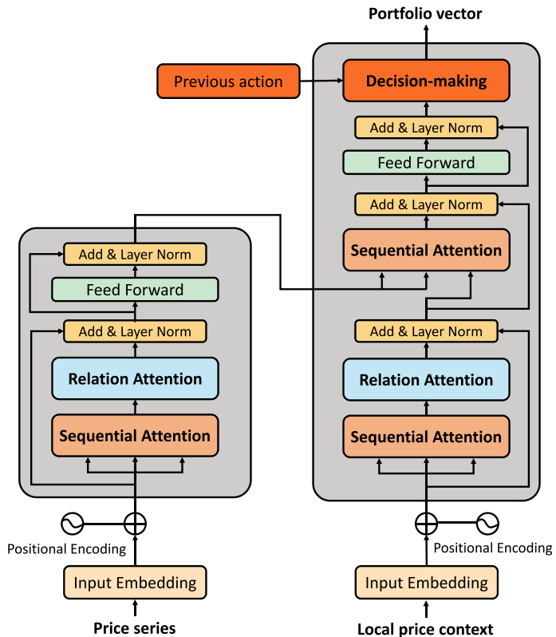

# Reimplementation of RAT
> Levon 2022.04.29

reimplementation of **Relation-Aware Transformer for Portfolio Policy Learning (RAT)** (IJCAI 2020) for the **portfolio management task**.

[\[Official paper\]](https://doi.org/10.24963/ijcai.2020/641), [\[Official code\]](https://github.com/Ivsxk/RAT), [\[Another unofficial code\]](https://github.com/louisoutin/rat_crypto_trader)




This reimplementation project has been linked to the corresponding [paperwithcode](https://paperswithcode.com/paper/relation-aware-transformer-for-portfolio) page.

## Dependencies

+ Pytorch 1.10.0
+ pandas 1.4.2
+ python 3.9
+ numpy 1.20.3

## Bugs to fix

+ [x] pandas.panel() 被官方舍弃，我重新通过 multi_index 实现高维表格
+ [ ] 官方仓库提供的 1.pkl 预训练模型如何导入，torch.load() 报错
+ [ ] ubuntu 报错：history_manager.py, line 192, in update_data, raise Exception("Have to be online")

## Citation

```
@inproceedings{xu-relation,
  title = {Relation-Aware Transformer for Portfolio Policy Learning},
  author = {Xu, Ke and Zhang, Yifan and Ye, Deheng and Zhao, Peilin and Tan, Mingkui},
  booktitle = {Proceedings of the Twenty-Ninth International Joint Conference on Artificial Intelligence}, 
  pages = {4647--4653},
  year = {2020},
  month = {7},
  note = {Special Track on AI in FinTech}
}
```
